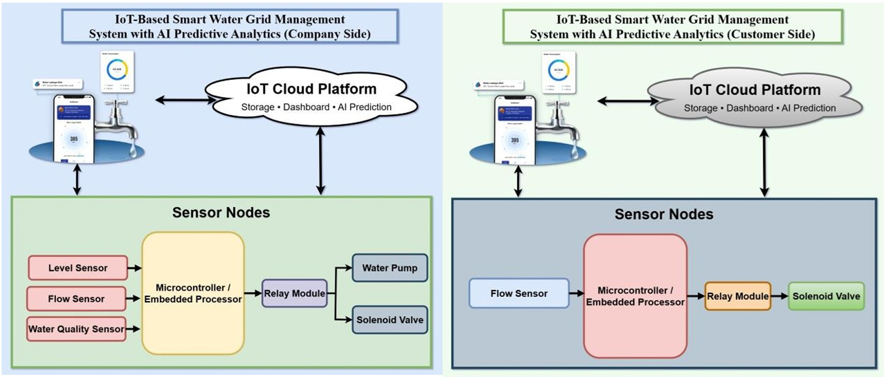
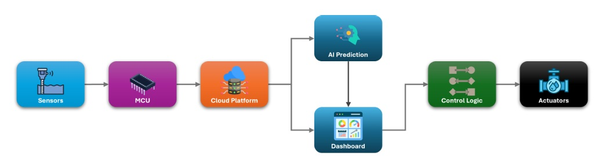
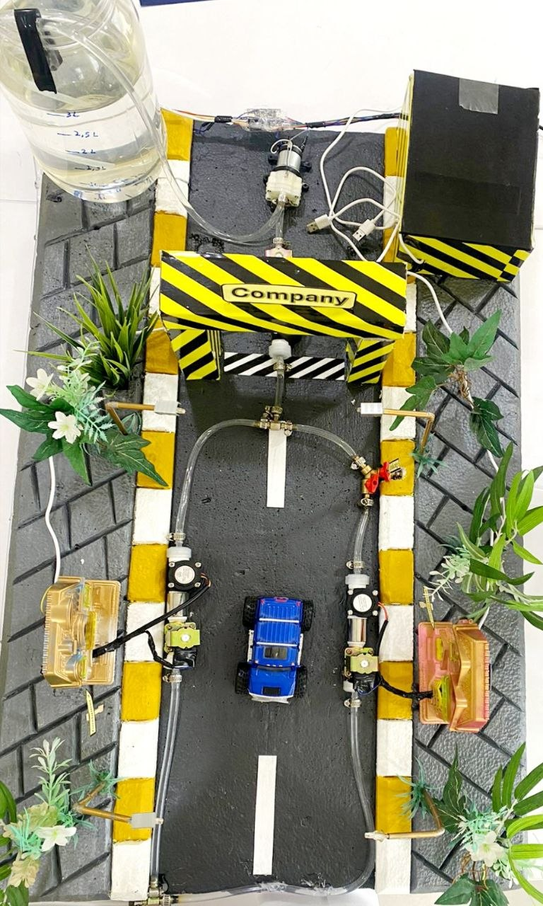
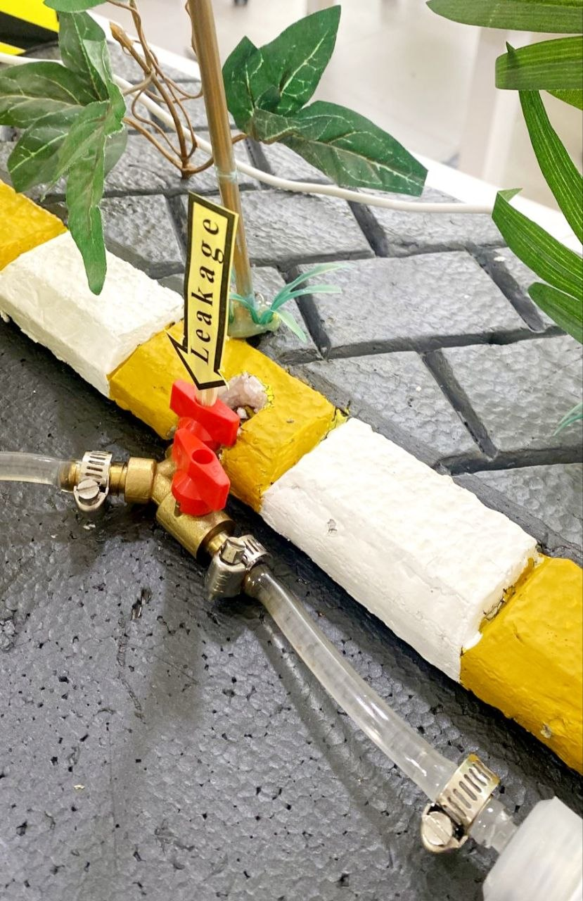
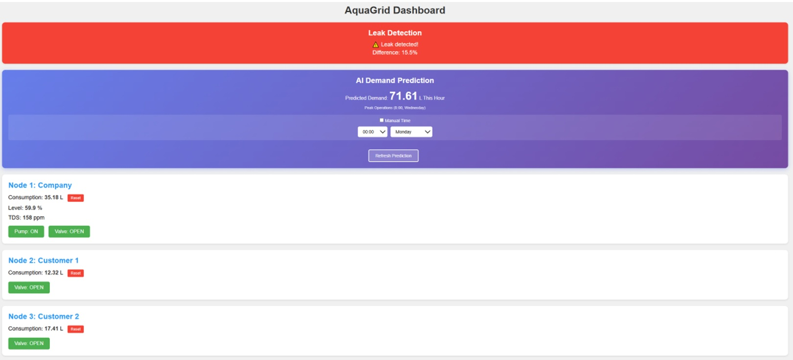
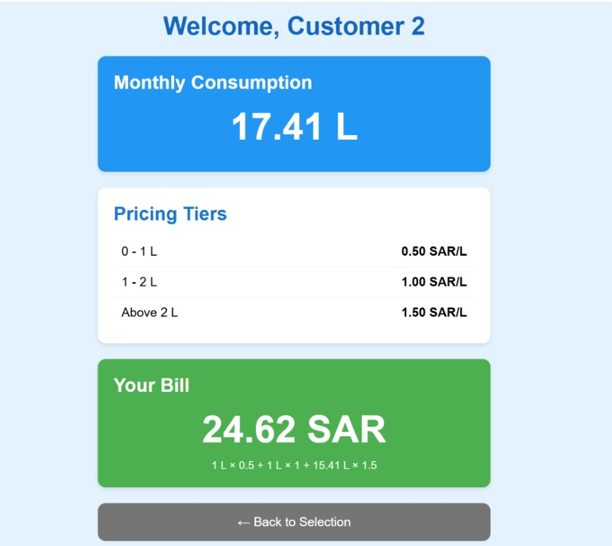
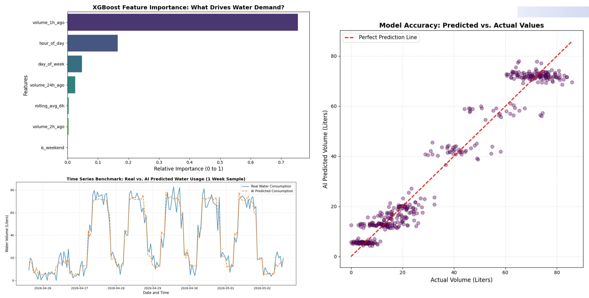
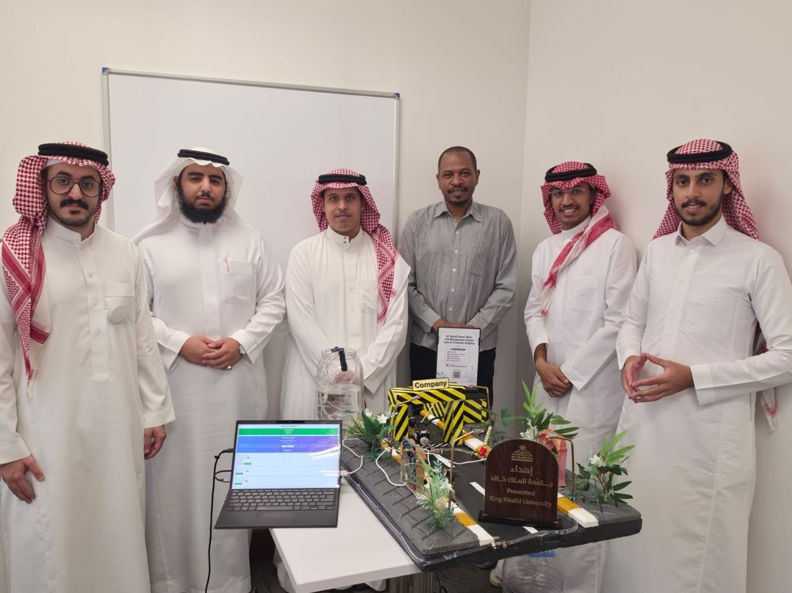

# IoT-Based Smart Water Grid Management System with AI Predictive Analytics

An AI-powered IoT platform for real-time water distribution monitoring, leakage detection, predictive analytics, intelligent water demand forecasting, and remote infrastructure management.

  

## Project Highlights

- 📡 Real-time IoT Monitoring
- 🤖 AI-based Water Demand Prediction
- 💧 Automatic Leakage Detection
- ☁️ Cloud Dashboards
- 🌐 Digital Twin Simulation

| Category | Details |
|----------|---------|
| Platform | IoT Smart Water Grid |
| Microcontroller | ESP32 |
| Programming | Arduino IDE, Python, HTML/CSS, JavaScript |
| AI Model | XGBoost |
| Cloud | Firebase |
| Dashboard | Company & Customer Web Dashboards |

## Overview

Water distribution networks face increasing challenges in infrastructure monitoring, leakage detection, and efficient resource management. Traditional monitoring methods often rely on manual inspection and provide limited real-time visibility, making it difficult to detect faults early and optimize water consumption.

This project presents an **IoT-Based Smart Water Grid Management System with AI Predictive Analytics** that integrates distributed ESP32-based sensing nodes, cloud connectivity, predictive analytics, and interactive web dashboards into a unified intelligent platform. The system continuously monitors water distribution, detects leakages, forecasts future water demand using an XGBoost machine learning model, and provides real-time visualization for both the water company and customers.

By integrating IoT, cloud computing, machine learning, and digital twin simulation, the proposed platform delivers an end-to-end intelligent water management solution that improves operational efficiency, minimizes water losses, supports predictive maintenance, and enables data-driven decision-making.

## System Architecture

The proposed platform consists of three distributed ESP32-based sensing nodes connected to a cloud platform, an AI prediction server, and two web dashboards for monitoring and management.

The architecture enables real-time data acquisition, cloud synchronization, AI-based demand forecasting, leakage detection, and remote visualization for both the water company and customers.

  

<em>Overall system architecture.</em>

  

<em>System data flow.</em>

## System Components

The proposed smart water grid management system integrates hardware, cloud services, AI analytics, and web applications into a unified platform. Three ESP32 sensor nodes collect real-time data from the water network and communicate exclusively through the Firebase Realtime Database, which acts as the central communication hub between all system components. The cloud infrastructure stores sensor data, synchronizes actuator commands, and provides data for visualization and AI-based demand prediction.

| Component | Description |
|-----------|-------------|
| **ESP32 Node 1 (Company Side)** | Monitors water level, flow rate, water quality (TDS), and pipeline pressure, while controlling the water pump and company-side solenoid valve. |
| **ESP32 Nodes 2 & 3 (Customer Side)** | Measure customer water consumption using flow sensors and control individual solenoid valves for water distribution. |
| **Firebase Realtime Database** | Central communication hub that stores sensor readings, synchronizes actuator commands, and connects all ESP32 nodes, dashboards, and AI services. |
| **AI Prediction Module (XGBoost)** | Predicts future water demand using historical datasets generated from the digital twin simulation. |
| **Company Dashboard** | Displays real-time system status, sensor values, alerts, historical trends, and provides remote actuator control. |
| **Customer Dashboard** | Allows customers to monitor water usage, consumption history, and billing information in real time. |
| **Digital Twin Simulation** | Python-based simulator that generates realistic water consumption datasets for AI model training and evaluation. |

## Hardware Prototype

The hardware prototype demonstrates the practical implementation of the proposed smart water grid management system. It consists of three ESP32-based sensing nodes integrated with water level, flow rate, water quality, and pressure sensing, along with relay-controlled actuators, solenoid valves, and a water pump. The prototype validates real-time monitoring, automatic control, cloud communication, and leakage detection in a realistic environment.

### Prototype Overview

  

<b>Figure 1.</b> Top view of the implemented smart water grid prototype.

### Leakage Detection Branch

  

<b>Figure 2.</b> Experimental leakage branch used to simulate pipeline leaks and evaluate the leakage detection mechanism.

## Cloud Dashboards

The system provides two dedicated web-based dashboards connected to the Firebase Realtime Database, enabling real-time visualization, remote monitoring, and intelligent management of the water distribution network. Each dashboard is designed to serve a different user role while maintaining synchronized system data.

### Company Dashboard

The company dashboard provides a comprehensive overview of the entire water distribution network. It enables operators to monitor sensor readings, control field actuators, track system status, and analyze historical data from a centralized interface.

  

<b>Figure 1.</b> Company dashboard for real-time monitoring and infrastructure management.

**Main Features**

- 📊 Real-time sensor monitoring
- 💧 Water level, flow rate, pressure, and water quality visualization
- ⚙️ Remote pump and solenoid valve control
- 🚨 Leakage alerts and system status monitoring
- 🤖 AI-based demand prediction integration

---

### Customer Dashboard

The customer dashboard provides end users with a simple interface for monitoring their individual water consumption and usage history. It enables customers to track water usage patterns through real-time and historical visualizations.

  

<b>Figure 2.</b> Customer dashboard for monitoring water consumption and usage statistics.

**Main Features**

- 💧 Real-time water consumption monitoring
- 📈 Historical usage visualization
- 📅 Daily and monthly consumption statistics
- 📱 Simple web-based user interface

## AI-Based Water Demand Prediction

To enhance decision-making, the system integrates an XGBoost machine learning model that predicts future water demand based on historical consumption patterns generated by the digital twin simulation. The prediction model helps estimate future consumption trends, enabling more efficient water resource planning and management.

  

<b>Figure 1.</b> Water demand prediction results generated using the XGBoost model.

### AI Prediction Workflow

- 📊 Historical water consumption data generation using the Digital Twin simulator
- 🧹 Data preprocessing and feature preparation
- 🤖 Model training using XGBoost
- 📈 Future water demand forecasting
- ☁️ Prediction results integrated into the cloud dashboards for visualization

## Repository Structure

The repository is organized into separate modules for firmware development, AI prediction, dashboards, simulation, documentation, and project resources.

| Directory | Description |
|----------|-------------|
| **firmware/** | Arduino firmware for the three ESP32 sensor nodes. |
| **dashboards/** | Web dashboards for the water company and customers. |
| **ai-server/** | Python server and trained XGBoost prediction model. |
| **simulation/** | Digital Twin simulator for generating water demand datasets. |
| **images/** | Project figures, architecture diagrams, prototype photos, dashboards, and AI results. |
| **docs/** | Complete project report and final presentation. |

## Documentation

The complete project documentation is available in the `docs` directory, including the final project report and presentation.

| Document | Description |
|----------|-------------|
| **Project book.pdf** | Complete project documentation, including system design, implementation, hardware architecture, software architecture, AI model development, evaluation, and conclusions. |
| **Final Presentation.pptx** | Final capstone presentation summarizing the project objectives, architecture, implementation, results, and demonstration. |

## Project Team

This project was developed as a Computer Engineering capstone project at King Khalid University. It combines embedded systems, cloud computing, web development, artificial intelligence, and digital twin simulation to demonstrate an intelligent IoT-based water distribution management platform.

  

<b>Project development team during the final project demonstration.</b>

---

# 📄 License

This project is protected by copyright.

It is published for **academic and portfolio purposes only**.

See the [LICENSE](LICENSE) file for the complete copyright and usage terms.
