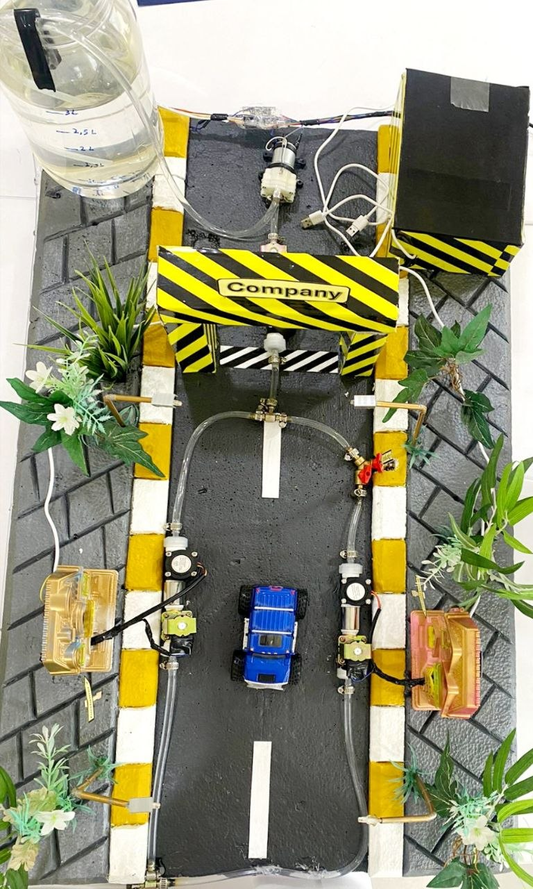

# IoT-Based Smart Water Grid Management System with AI Predictive Analytics

An AI-powered IoT platform for real-time water distribution monitoring, leakage detection, predictive analytics, intelligent water demand forecasting, and remote infrastructure management.

  

## Project Highlights

- 📡 Real-time IoT Monitoring
- 🤖 AI-based Water Demand Prediction
- 💧 Automatic Leakage Detection
- ☁️ Cloud Dashboards
- 🌐 Digital Twin Simulation

| Category | Details |
|----------|---------|
| Platform | IoT Smart Water Grid |
| Microcontroller | ESP32 |
| Programming | Arduino IDE, Python, HTML/CSS, JavaScript |
| AI Model | XGBoost |
| Cloud | Firebase |
| Dashboard | Company & Customer Web Dashboards |
